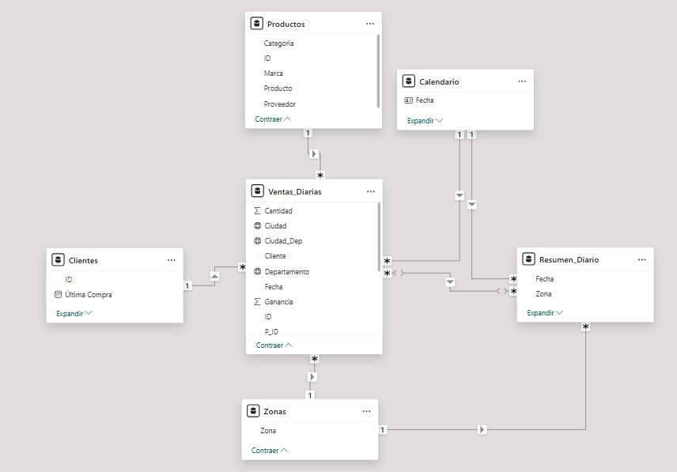

# 📊 Dashboard de Análisis de Ventas

**Un proyecto de análisis de datos para optimizar las ventas digitales y la gestión de clientes en Distribuciones Rehobot.**
* *Empresa: Distribuciones Rehobot*

* *Herramienta: Power BI*

* *Fecha: Septiembre 2025*


---

## 🚀 Contexto del Proyecto

La empresa **Distribuciones Rehobot** está en un proceso de **transformación digital**, migrando su modelo de ventas de lo presencial a lo online. El objetivo principal es alcanzar un 80% de ventas digitales para:

* **Reducir costos operativos.**
* **Mejorar la gestión de la cartera vencida.**
* **Optimizar la atención a los clientes más valiosos.**

Los datos utilizados para este análisis son registros reales de ventas, clientes y productos, recolectados en formato Excel desde junio de 2025.

---

## 🎯 Objetivo del Dashboard

El propósito de este proyecto fue crear un **dashboard interactivo en Power BI** que sirviera como una herramienta clave para la toma de decisiones, permitiendo a la empresa:

* Monitorear la evolución de las ventas y la cartera de clientes.
* Identificar productos de alta y baja rotación.
* Detectar clientes estratégicos y de riesgo.
* Evaluar la eficiencia de los métodos de pago.

---

## ❓ Preguntas de Negocio Respondidas

Este dashboard responde a preguntas cruciales para la operación del negocio:

* ¿Cuál es la evolución de las **ventas** y la **cartera** desde junio hasta la fecha?
* ¿Qué **productos** son los más vendidos y cuáles tienen baja rotación?
* ¿Qué **clientes** representan la mayor proporción de ingresos y deudas?
* ¿Cómo se comportan los **métodos de pago** (contado vs. crédito) a lo largo del tiempo?

---

## 🛠️ Herramientas Utilizadas

* **Power BI:** Para la visualización, modelado de datos y creación del dashboard.
* **Excel:** La fuente de datos original (ventas diarias, clientes, productos, cartera).
* **DAX:** Utilizado para la creación de medidas y KPIs personalizados que impulsan las visualizaciones.
* **GitHub:** Empleado para la documentación técnica y como portafolio del proyecto.

---

## 📈 Visualizaciones Clave

El dashboard incluye las siguientes visualizaciones estratégicas para una vista integral del negocio:

* **Ventas Totales y Evolución Temporal:** Gráficos de tendencias semanales y mensuales.
* **Top Productos y Rotación:** Clasificación de productos por volumen de ventas y rentabilidad.
* **Clientes Estratégicos y Cartera:** Segmentación de clientes cumplidos versus clientes con cartera vencida.
* **Métodos de Pago:** Comparación del rendimiento de ventas a contado vs. a crédito.
* **Ventas y Cartera por Zona:** Mapas o gráficos para obtener insights regionales.

---

## 📂 Estructura del Repositorio
* ``` MARKDOWN
  Capturas/
    ├── kpi´s_globales.png
    ├── clientes y cartera.png
    ├── productos y proveedores.png
    └── tendencias en el tiempo.png
    └──ventas por zona.png
  DAX_Measures/
    ├──DAX_Measures.md
  Modelo_de_Datos/
    ├──Data_Model.md
    └──model.png  
  └── Alcance_Proyecto.pdf
  └── Dashboard_Rehobot.pbix
  └── PROYECTO_1.XLXS
  └── README.md

---
## 📐 Modelo de Datos


👉 Ver detalle completo de las relaciones: [Data_Model.md](Modelo_de_Datos/Data_Model.md)

## 🧮 Medidas DAX Principales

Algunas de las medidas clave creadas en DAX para este proyecto (puedes encontrar más detalles en la carpeta `DAX_Measures`):

* `Ventas Totales = SUM(Ventas_Diarias[Precio_Venta])`
* `Ticket Promedio = DIVIDE([Ventas Totales], [Cantidad de Ventas])`
* `Clientes Únicos = DISTINCTCOUNT(Clientes[ID_Cliente])`

---

## 🚀 Impacto del Proyecto

Este dashboard no solo cumple los objetivos iniciales, sino que también genera un impacto significativo al permitir a la empresa:

* Tomar **decisiones informadas** sobre la gestión de productos y clientes.
* Obtener un **mejor control** de la transición entre ventas digitales y presenciales.
* Establecer una **estrategia de cobranza** más clara gracias al análisis de cartera.
* Demostrar habilidades en **análisis de datos**, **modelado en Power BI** y aplicación de **DAX**.

---

## 🔗 Cómo Navegar el Proyecto

* Explora las medidas DAX detalladas en la carpeta **`DAX_Measures/`**.
* Revisa las capturas de pantalla de las visualizaciones en la carpeta **`Capturas/`**.
*Consulta el documento Excel utilizado para recopilar los datos **`PROYECTO_1.xlsx`**.
* Analiza el Dashboard creado con el archivo **`Dashboard_REHOBOT.pbix`**.
* Consulta el documento de alcance inicial del proyecto en **`Alcance_Proyecto.pdf`**.
---
👨‍💻 Autor

Nicolás Gómez
Data Analyst Jr. | Enfocado en proyectos de Business Intelligence y migración digital.

📌 Conéctate conmigo en [LinkedIn](https://www.linkedin.com/in/nicolas-gomez-remote/)
